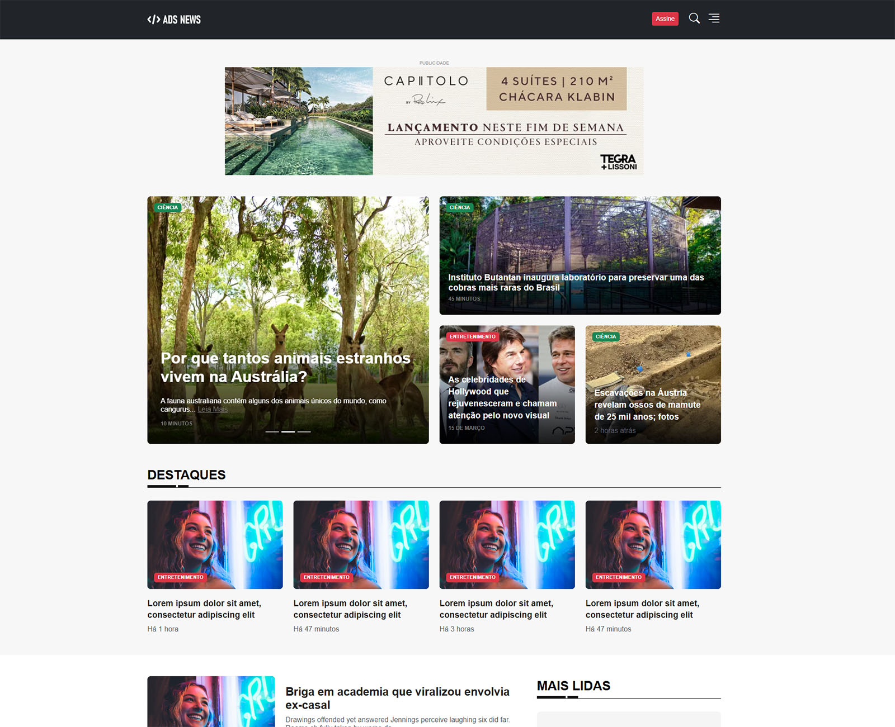

# ADS-News

  

## 📜 Sobre o Projeto
**ADS-News** é um portal de notícias dinâmico que consome a API do New York Times para exibir manchetes, notícias em destaque e categorias específicas. Utiliza **Bootstrap** para um design responsivo e moderno, proporcionando uma experiência de usuário intuitiva.

---

## 📸 Capturas de Tela


---

## 🚀 Tecnologias Utilizadas
- **HTML5**  
- **CSS3**  
- **JavaScript**  
- **Bootstrap 5.3**  
- **API do New York Times**  

---

## 📝 Funcionalidades
- Exibe notícias em tempo real da API do New York Times  
- Design responsivo e moderno usando Bootstrap  

---

## 📦 Como Usar

1. Clone este repositório:  
```bash
git clone https://github.com/andreantoniobr/ads-news
```

2. Acesse a pasta do projeto:  
```bash
cd ads-news
```

3. Crie um arquivo `config.js` na raiz do projeto e adicione sua chave da API:  
```env
export const API_KEY = '';
export const API_URL = 'https://api.nytimes.com/svc/topstories/v2/science.json';
export const RT_API_URL = 'https://api.nytimes.com/svc/news/v3/content/nyt/business.json';
```

4. Abra o arquivo `index.html` em seu navegador.  

---

## 🌐 Consumo da API
Para obter sua chave de API, acesse [New York Times Developer](https://developer.nytimes.com/get-started) e crie uma conta. Adicione a chave ao seu arquivo `.env`.

---

## 📝 Licença
Este projeto está sob a licença MIT - veja o arquivo [LICENSE](LICENSE) para mais detalhes.

---

## 👤 Autores

 **André Antônio** - [GitHub](https://github.com/andreantoniobr/)

**Paulo Cleidson** - [GitHub](https://github.com/Paulo-Cleidson)

**Thiago Araujo** - [GitHub](https://github.com/Thiago-Arauj)
